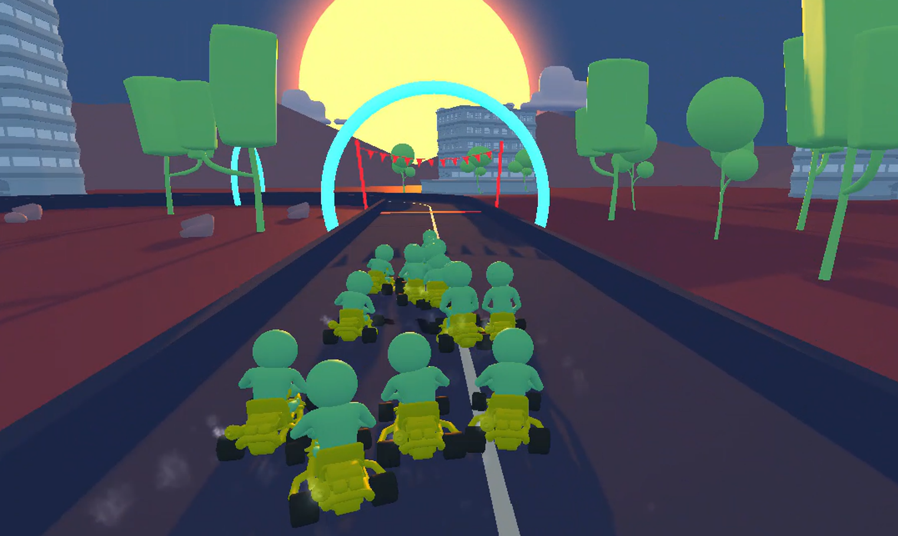

# Reinforcement Learning Kart Game

The goal of this project is to teach an agent how to drive a go-kart on its own on any track using reinforcement learning.

<p align="center">
  
</p>

## Built With

This project was build using the following technologies:

- [Unity](https://unity.com/)
- [C#](https://learn.microsoft.com/en-us/dotnet/csharp/)
- [Unity Machine Learning Agents](https://unity.com/products/machine-learning-agents)
- [TensorFlow](https://www.tensorflow.org/)

## Installation

### Prerequisites

- Install Unity 2020.3.30f1
- Install Python

### Run project

1. Open the project in Unity
2. Click the Play button to see the result from the currently trained model.

### Train the model

1. Buil your own track or use the existing ones. Make sure the Training Checkpoints are in the correct order.
2. For each Agent (KartClassic_MLAgent) in the KartAgent/Checkpoints/Colliders section (in the inspector) assign the Training Checkpoints of the corresponding training track.
3. For each Agent, in the inspector, change the Mode from inferencing to training and set the Model to none.
4. Open up a terminal and go to the project repository.
5. Activate the python virtual environment

```sh
venv\Scripts\activate
```

6. Start training by running this command

```sh
mlagents-learn Assets\Karting\Prefabs\AI\kart_mg_trainer_config.yaml --train --run-id=give-a-name
```

7. Go back to unity and press the Play button to actually start training.
8. Once your model is trained, press the play button to stop training. The model is automatically saved to the _models_ folder.
9. To see the result from the training, change the Mode back to inferencing training and set the Model to the one just trained ( _.nn_ file).

## Sources

- [Unity ML agents git](https://github.com/Unity-Technologies/ml-agents)

- [Karting Microgame Unity Learn](https://learn.unity.com/project/karting-template?utm_source=Unity+YouTube&utm_medium=social&utm_campaign=evangelism_global_generalpromo_2020-05-20_karting-microgame)

- [How to use Machine Learning AI in Unity](https://www.youtube.com/watch?v=zPFU30tbyKs)
